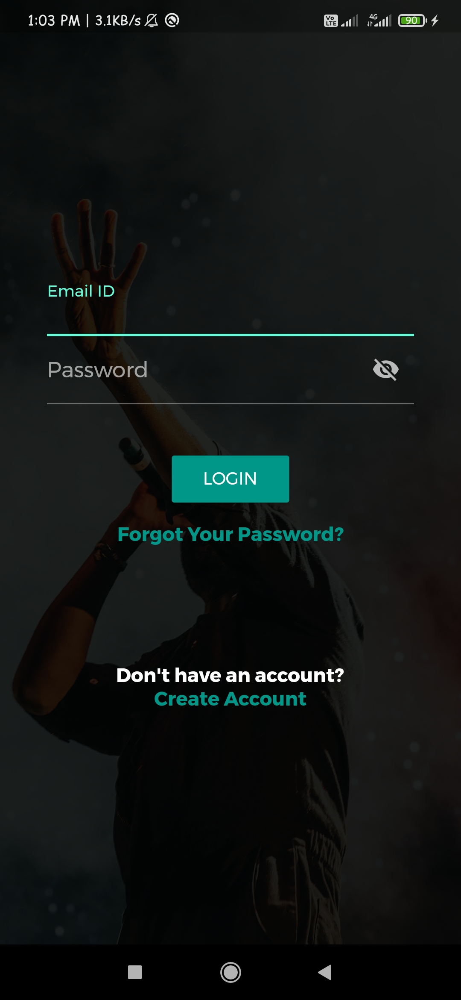
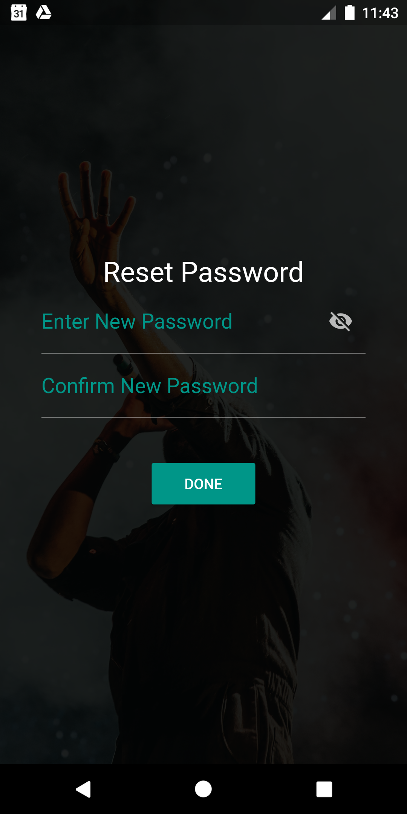
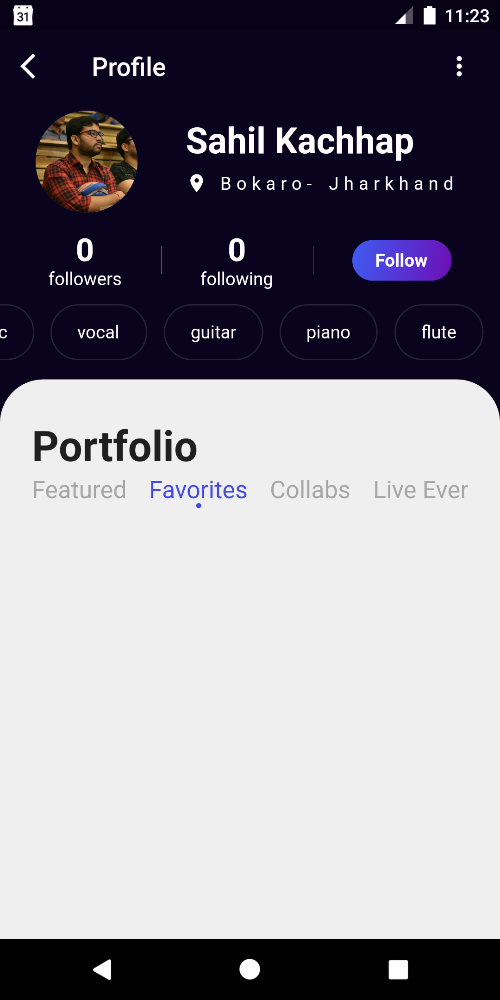

# Musical Match- A Musician Match Finder App

## 📸 ScreenShots

|            Login Screen              |              Register Screen              |
| :----------------------------------: | :----------------------------------: |
|    | |
|           Forgot Password Screen            |              Profile Page             |
|    | |

### Show some :heart: and star the repo to support the project

## Overview
A Digital Place where anyone can search for Musicians nearby their location and Collaborate with them for any kind of Live Music Event or For creating a Music band.

## Technology Stack
- Flutter
- Firebase (Backend)

## Getting Started 🚀
- Fork The Repo
- Clone the repo `git clone https://github.com/Sahil-kachhap/GDG-Devfest-India`
- Install the dependicies `flutter pub get`
- Run it `flutter run`

